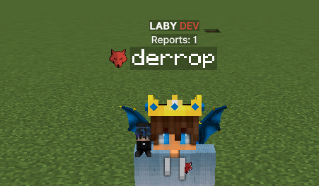
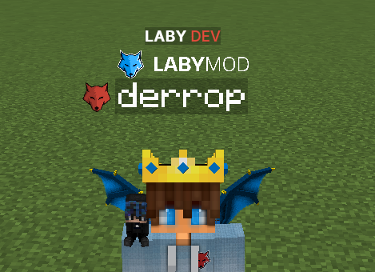

Just like integrated tags like the "LABY DEV/..." team tags addons can also add custom tags
that seamlessly integrate with any other tags:


## Snapshot extras

This is what our Snapshot extra will look like for this example. For simplicity the implementation
details for the Snapshot extra will be skipped in this example, please make sure to read
the previous page [Entity Snapshots](entity-snapshots.md) beforehand.

=== ":octicons-file-code-16: ExampleTagExtraKeys"
    ```java
    package org.example.myaddon.api.snapshot;

    import net.labymod.api.laby3d.renderer.snapshot.ExtraKey;
    
    public class ExampleTagExtraKeys {

        // The key must be something unique within your addon; it will automatically include your addon's namespace
        public static final ExtraKey<ExampleTagUserSnapshot> EXAMPLE_USER_TAG = ExtraKey.of("example_user_tag", ExampleTagUserSnapshot.class);
        
        // ... add more keys as required
    }
    ```

=== ":octicons-file-code-16: ExampleTagUserSnapshot"
    ```java
    package org.example.myaddon.api.snapshot;

    import net.labymod.api.client.component.Component;
    import net.labymod.api.laby3d.renderer.snapshot.LabySnapshot;
    
    public interface ExampleTagUserSnapshot extends LabySnapshot {
        
        int reports();
      
        // ... put in whatever custom data you want
    }
    ```

## Component NameTags

ComponentNameTags can be used to display a text component around the player name like so:



=== ":octicons-file-code-16: ExampleAddon"
    ```java
    package org.example.myaddon;

    @AddonMain
    public class ExampleAddon extends LabyAddon<ExampleConfiguration> {
        
        @Override
        protected void enable() {
            Laby.references().tagRegistry().register(
                "my_custom_component",
                PositionType.ABOVE_NAME,
                new MyCustomNameTag()
            );
        }
    }
    ```

=== ":octicons-file-code-16: MyCustomNameTag"
    ```java
    package org.example.myaddon.tag;
    
    import org.example.myaddon.api.snapshot.ExampleTagExtraKeys;
    import org.example.myaddon.api.snapshot.ExampleUserSnapshot;
    import java.util.List;
    import net.labymod.api.client.component.Component;
    import net.labymod.api.client.entity.player.tag.tags.ComponentNameTag;
    import net.labymod.api.client.render.state.entity.EntitySnapshot;
    import org.jetbrains.annotations.NotNull;
    
    public class MyCustomNameTag extends ComponentNameTag {
    
        @Override
        protected @NotNull List<Component> buildComponents(EntitySnapshot snapshot) {
            if (!snapshot.has(ExampleTagExtraKeys.EXAMPLE_USER_TAG)) {
                return super.buildComponents(snapshot);
            }
    
            ExampleTagUserSnapshot userSnapshot = snapshot.get(ExampleTagExtraKeys.EXAMPLE_USER_TAG);
            int reports = userSnapshot.reports();
            
            if (reports > 0) {
                return List.of(Component.text("Reports: " + reports));
            }
            
            return List.of();
        }
        
        // You can override this method to include your own custom logic, but make sure
        // to include the call to super.isVisible();
        // The NameTag is always hidden as long as buildComponents() returns an empty list
        // @Override
        // public boolean isVisible() {
        //     return super.isVisible() && <implement custom visibility logic>;
        // }
        
        // You can override this method to change the scale of your NameTag, default is 1.0
        // @Override
        // public float getScale() {
        //     return 0.5F;
        // }
    }
    ```

## Icon Tags

IconTags can be used to display any icon around the player name like so:



=== ":octicons-file-code-16: ExampleAddon"
    ```java
    package org.example.myaddon;

    @AddonMain
    public class ExampleAddon extends LabyAddon<ExampleConfiguration> {
        
        @Override
        protected void enable() {
            Laby.references().tagRegistry().register(
                "my_custom_icon",
                PositionType.ABOVE_NAME,
                new MyCustomIconTag()
            );
        }
    }
    ```
    
=== ":octicons-file-code-16: MyCustomIconTag"
    ```java
    package org.example.myaddon.tag;
    
    import org.example.myaddon.api.snapshot.ExampleTagExtraKeys;
    import net.labymod.api.client.entity.player.tag.tags.IconTag;
    import net.labymod.api.client.gui.icon.Icon;
    import net.labymod.api.client.render.state.entity.EntitySnapshot;
    
    public class MyCustomIconTag extends IconTag {
    
        public MyCustomIconTag() {
            super(36.5F, 8F); // width, height
            // super(8F); // or just size (if width == height)  
        }
        
        // You can override this method to include your own custom logic, but make sure
        // to include the call to super.isVisible();
        // The IconTag is always hidden as long as getIcon() returns null
        // @Override
        // public boolean isVisible() {
        //     if (!this.snapshot.has(ExampleTagExtraKeys.EXAMPLE_USER_TAG)) {
        //         return false;
        //     }
        // 
        //     return super.isVisible() && this.snapshot.get(ExampleTagExtraKeys.EXAMPLE_USER_TAG).reports() > 0;
        // }
        
        @Override
        public Icon getIcon(EntitySnapshot snapshot) {
            // Return any Icon that you want to be rendered,
            // or null to hide the Tag for this Entity.
            // If the Icon is static and the same for each Entity you may
            // also pass it in the constructor and don't implement getIcon().
            return Icon.url("https://labymod.net/page/tpl/assets/images/logo.png");
        }
    }
    ```
